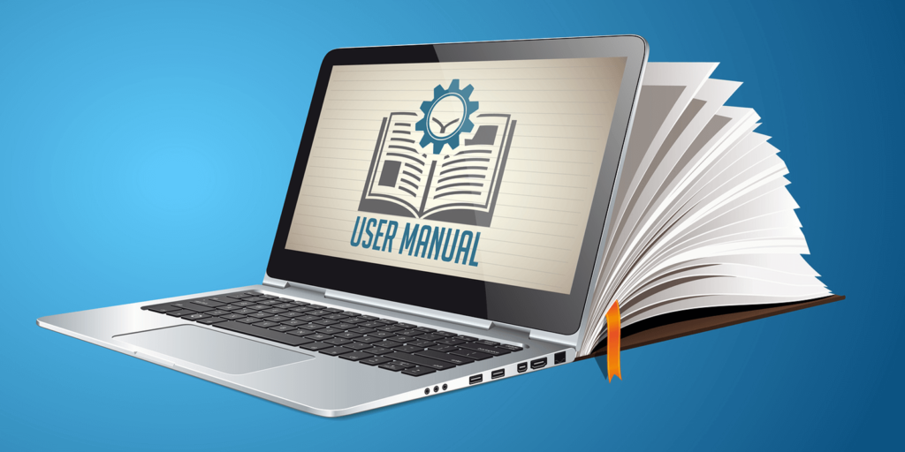

Unresponsive SME - how to handle.
=================================

If you are reading this blog post, I assume you are a Technical Writer. And also, I assume you have some doubts or difficulties related to your relationship with your SME. Sounds familiar? If the answer is ‘yes’ to at least one of those assumptions, please take a moment and have a look at what suggestion I might have for you.

## **Who is Who?**

Let’s start from the beginning and check who is who in this technical writing journey.

Who is a **Technical Writer**? To not bore you with Wiki definition, in simple words, it’s a person who takes advanced technical concepts and communicates them as clearly, accurately, and comprehensively as possible to their intended audience, ensuring that the work is accessible to its users.

And who is **SME**? SME stands for subject-matter expert and is also known as a domain expert. Basically, it is the person who has the answers to your questions and without them, you are not able to finish your project. So, you are dependent on your SME and for sure you want to have good relations to work efficiently. 

## **People are just people.**

People are just people, and as cliche, as it sounds, it also is very real. Just think of SME as a normal human being: he can have bad or good humor, have some private problems, might be introverted, and many other factors might influence their attitude. Same as you. Put yourself in their shoes. Maybe they are swamped with other projects, or maybe they don’t like the project which you share. You wouldn’t be a ray of sunshine if you were overwhelmed by work or private problems, right?

Keeping that in mind, think how you would like to be approached? Any suggestions?

1. **Try to be friendly and make an effort to know better your SME.**
How? Have a coffee together, or lunch or beer . Try to talk about your hobbies or plans for weekend or summer holidays. Maybe share Netflix show recommendation. Just break the ice between two of you.

2. **Respect time of your SME.** 
And yours too. If you are struggling to set up a meeting with your busy SME but luckily you managed to have some time with them, do them and yourself a favor and be prepared! Propose an agenda of the meeting so the SME can also prepare themselves. Ask crucial questions and not obvious ones. Prepare some prospects. Take as much as you can from those meetings. 

3. **Choose the right communication channel.**
Not everybody is a ‘people person’ and may not have the pleasure to meet in person. Nowadays, we work in international companies or totally remotely and we might live in different locations. Therefore, it might be hard to have a chat face to face. We have a wide range of communication channels to choose from. Check what would be the best for contacting your SME.

4. **Friendly reminder.**
Waiting and waiting for response from SME but with no luck? Remember, they are normal human beings and people forget stuff. Remind them about your request, in a friendly manner. 

*A tip from me: a funny meme can be an icebreaker.*

Keeping all of this in mind, just think in what environment you like to work and try to approach your SME the way you would like to be approached, in respectful, friendly and trustworthy manner. I bet most people would like that (if we don’t have to deal with psychopaths ).

Conclusion: **A Happy SME = A Happy Technical Writer**

Happy writing!

